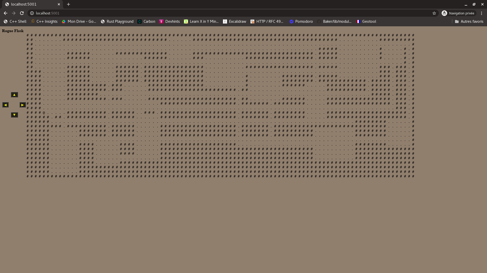

# Rogue nethack with Flask

Programme Python servant de base à l'évaluation par projet du cours Programme coopérants et Web Intro. 


## Execution du programme 

Dans le dossier racine du dépôt, il suffit de lancer 

```bash 
python app.py 
```

Et ensuite dans le navigateur allez à l'url `localhost:5001` vous verrez alors apparaitre la page suivante : 




Vous pouvez alors déplacer le personnage (symboliser par un `@`) à l'aide des boutons de navigations ou des fleches de votre clavier. 

## Description du code 

Le code est assez sommaire.

Dans `game_backend` vous trouverez la gestion du jeux. En l'état il y a surtout la génération de la map et la gestion du personnage pour qu'il ne puisse pas traverser les murs. 

Dans `app.py` vous avez le serveur Flask qui s'occupe de faire l'interaction entre le client (la page html) et le backend de jeux. 

Dans templates vous avez la page html et dans `static/js` les quelques fonctions javascript nécessaire à l'interaction (les déplacements du personnage). 

## Travail à faire 

Pour rappel le travail attendu est d'enrichir ce squelette de code de la manière suivante (trié par ordre croissant d'importance) : 

1. Ajout de monstre/trésors/équipements apparents et/ou cachés sur la map 
2. Ajout d'un mode multi-joueur (possibilité pour les joueurs de s'attaquer entre eux) 
3. Amélioration de l'interface côté joueur (j'ai fait un html pas très beau à vous de faire mieux) 
4. Système de niveau (pour le mode joueur unique) 
5. Possibilité de sauvergarder sa partie et de revenir plus tard (pour le mode jouer unique)  

Pour la notation, histoire qu'il n'y ait pas de surprise, voici les règles : 
* Si le point (1) est traité => 10/20 
* Si les points (1) + (2) sont traités => 13/20 
* Si les points (1) + (2) + (3) sont traités => 15/20 
* Si les points (1) + (2) + (3) + (4) sont traités => 18/20 
* Si les points (1) + (2) + (3) + (4) + (5) sont traités => 20/20

La date de rendu, qui est fixée dans le github classroom, est le **03/05/2021 à 12h00**. 
